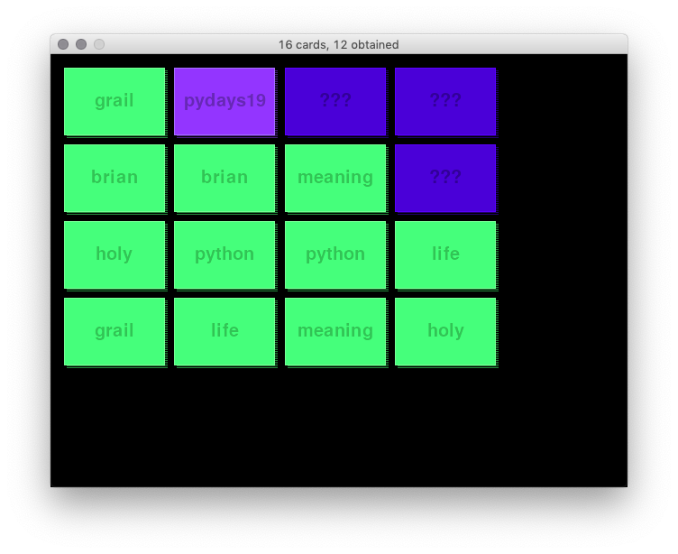

## PyDays Vienna 2019: Python Beginner Workshop

This repository contains the example code for the Python Beginner Workshop at
PyDays Vienna, May 2019:
[Python Beginner Workshop](https://cfp.linuxwochen.at/de/LWW19/public/events/973)

The point of this is not to be the most idiomatic Python code or even the most
efficient code, but rather a nice way to teach about basics of object oriented
programming in Python to create a small, self-contained game in ~ 200 lines.

With apologies to the classic [Windows Solitaire](https://en.wikipedia.org/wiki/Microsoft\_Solitaire)...

